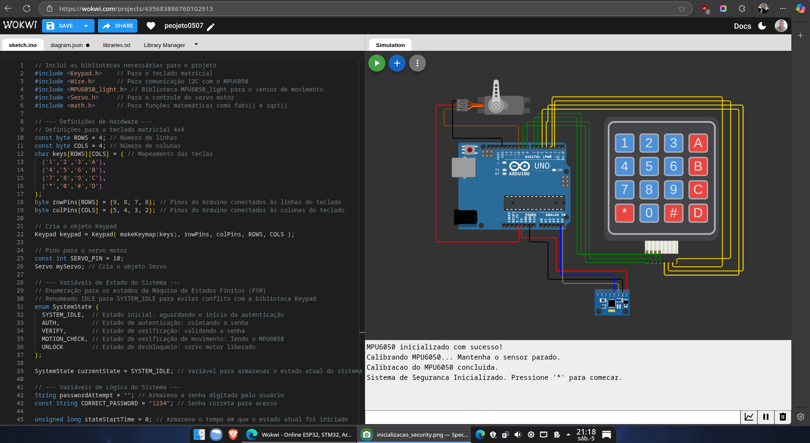
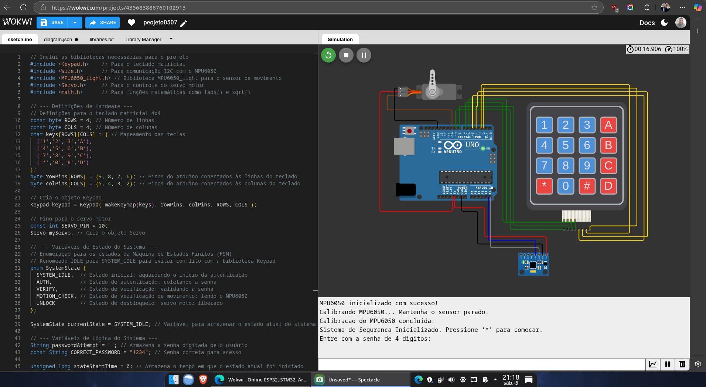
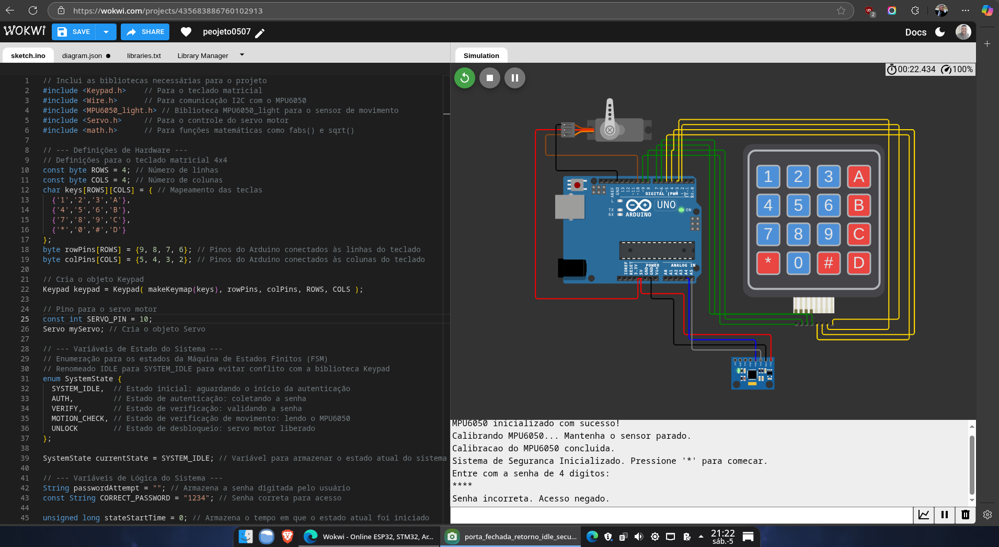
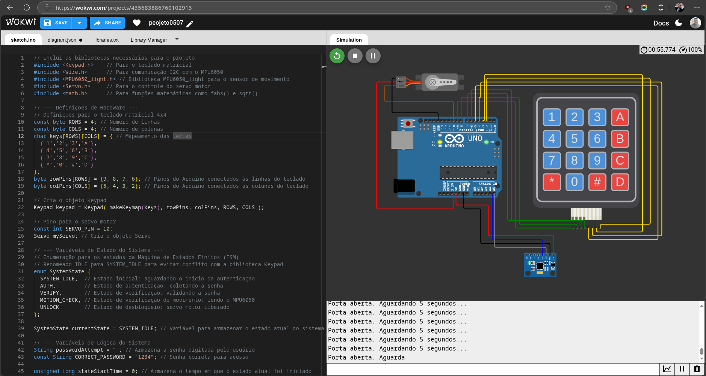
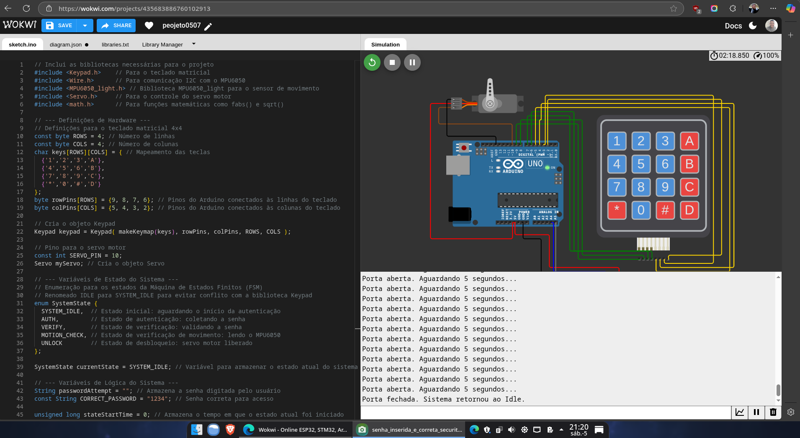
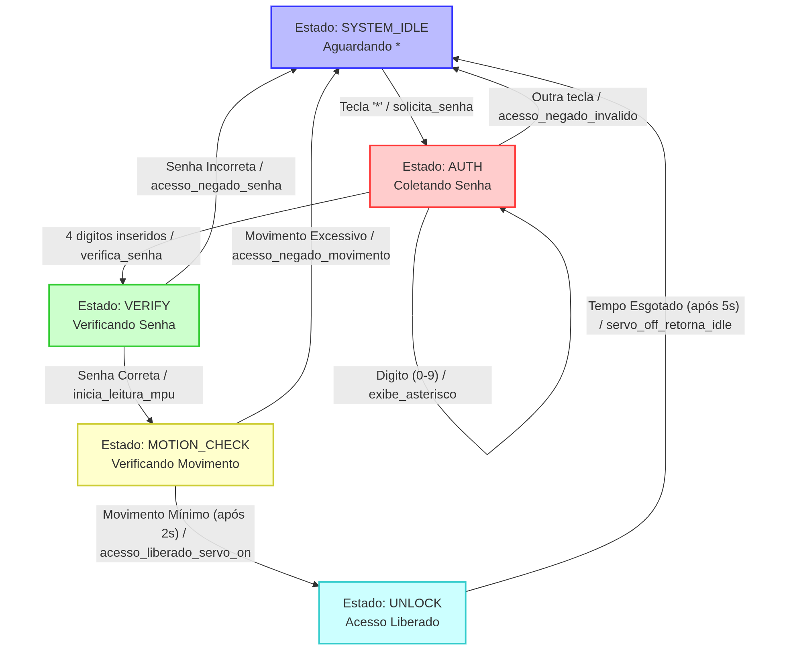
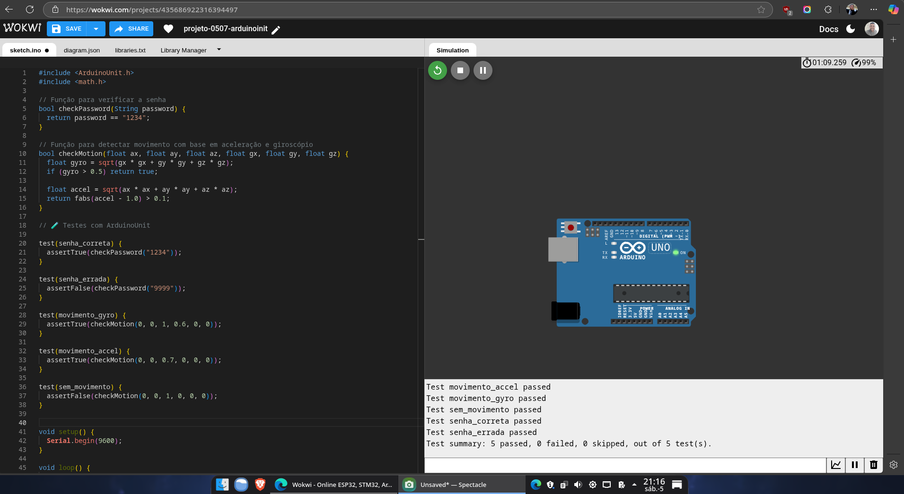
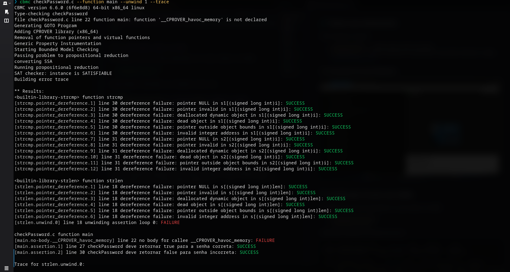
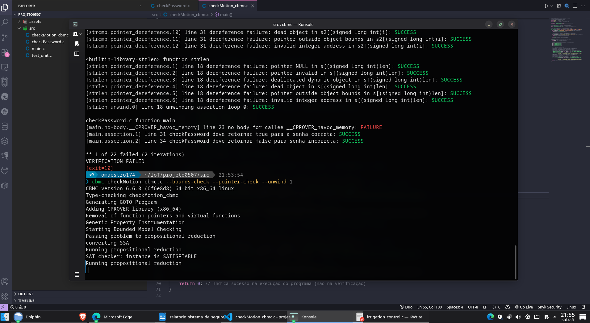

# 🎯 Sistema de Segurança com Verificação Formal para Indústria 4.0


**Aluno:** Janei Vieira   
**Disciplina:** ECAI – IoT   
**Data:** 05/07/2025  
**Sistema Completo:** [https://wokwi.com/projects/435683886760102913](https://wokwi.com/projects/435683886760102913)  
**Testes Unitários:** [https://wokwi.com/projects/435686922316394497](https://wokwi.com/projects/435686922316394497)  
**Repositório Github:** [https://github.com/oMaestro174/sistema-de-seguranca-iot](https://github.com/oMaestro174/sistema-de-seguranca-iot)  


## 📌 Objetivo do Projeto

Este projeto consiste no desenvolvimento de um sistema embarcado de controle de acesso para ambientes industriais, utilizando um Arduino UNO. O sistema implementa uma **máquina de estados de Mealy** para gerenciar o fluxo de autenticação via teclado matricial e detecção de movimento com um sensor MPU6050. A segurança e a robustez do sistema são aprimoradas através de testes de unidade com ArduinoUnit e verificação formal de funções críticas utilizando o C Bounded Model Checker (CBMC).

## 🔧 Componentes e Ligações 🔌

**Arduino UNO + Periféricos:**

- **Teclado 4x4**: Pinos D9 a D2 (linhas/colunas)
- **Servo Motor**: Pino D10 (sinal), 5V, GND
- **MPU6050**: Pinos A4 (SDA), A5 (SCL), 5V, GND


### 🟦 1. Teclado Matricial 4x4

O teclado possui 8 pinos: 4 linhas e 4 colunas. No código usamos:

| Função   | Pino do Teclado | Pino do Arduino UNO |
|----------|------------------|----------------------|
| Linha 1  | R1               | D9                   |
| Linha 2  | R2               | D8                   |
| Linha 3  | R3               | D7                   |
| Linha 4  | R4               | D6                   |
| Coluna 1 | C1               | D5                   |
| Coluna 2 | C2               | D4                   |
| Coluna 3 | C3               | D3                   |
| Coluna 4 | C4               | D2                   |

💡 **Dica:** Ligue em sequência da esquerda para a direita no Wokwi ou Protoboard, e siga a ordem correta no código do `Keypad`.

---

### 🟧 2. Servo Motor

| Fio do Servo             | Conecta em                  |
|--------------------------|-----------------------------|
| Sinal (laranja/amarelo)  | D10 (pino de controle no código) |
| VCC (vermelho)           | 5V                          |
| GND (preto/marrom)       | GND                         |

⚠️ **Atenção:** Use um capacitor ou fonte externa se o servo estiver tremendo ou fraco.

---

### 🟨 3. MPU6050 (I2C)

A MPU6050 se comunica via I2C, com 4 pinos principais:

| Pino MPU6050 | Pino Arduino |
|--------------|--------------|
| VCC          | 5V           |
| GND          | GND          |
| SDA          | A4           |
| SCL          | A5           |

🔒 **Nota:** Verifique se o endereço I2C da MPU é `0x68`, o padrão.

---


### 📸 Imagem de Ligações:
Sistema iniciado


Solicitação de senha


Senha inserida e inccorreta dá Acesso Negado


Senha inserida e correta Porta Abre


Após 5 segundos porta Fechada e Retorno ao IDLE 



---

## 🧠 Diagrama da FSM de Mealy

Estados principais:
- `SYSTEM_IDLE`: Espera o início (`*`)
- `AUTH`: Coleta senha (4 dígitos)
- `VERIFY`: Verifica senha (`1234`)
- `MOTION_CHECK`: Aguarda imobilidade por 2s com MPU6050
- `UNLOCK`: Libera acesso por 5s com o servo

### 📸 FSM em Imagem:



---

## 💻 Código Arduino

Implementado em C++ com estrutura `switch-case`, utilizando:

- `Keypad.h`, `Wire.h`, `MPU6050_light.h`, `Servo.h`
- Funções auxiliares: `checkPassword()` e `checkMotion()`

### 📸 Exemplo do Código Principal:
Acesse o código em [src/main_system_sketch.ino](/src/main_system_sketch.ino)

---

## 🧪 Testes com ArduinoUnit

Foram testadas as funções:

- `checkPassword()` — Verifica senha correta e incorreta
- `checkMotion()` — Detecta movimento via acelerômetro e giroscópio
Utilizando o código: [src/unit_tests_sketch.ino](/src/unit_tests_sketch.ino)

### 📸 Screenshot do Serial Monitor:


---

## 🔍 Verificação Formal com CBMC

As funções críticas foram exportadas em C para análise com CBMC:

- `checkPassword.c`
- `checkMotion.c`

Verificações realizadas via terminal Linux com:

```bash
cbmc checkPassword.c --function main --unwind 1 --trace

cbmc checkMotion.c --function main --unwind 1 --trace
```

### 📸 Screenshot do Terminal CBMC:

Tela de teste CBMC para Senhas


Tela de teste CBMC para Motios (inconclusivo)



### Interpretação dos Resultados do CBMC:

* **`VERIFICATION SUCCESSFUL`:** Significa que o CBMC não encontrou nenhum contra-exemplo que viole as asserções para o escopo explorado. 

* **`VERIFICATION FAILED`:** Significa que o CBMC encontrou um contra-exemplo (um conjunto de valores de entrada que faz sua asserção falhar). 

## 📚 Material de Apoio e Referências

* **ArduinoUnit:** [https://github.com/mmurdoch/ArduinoUnit](https://github.com/mmurdoch/ArduinoUnit)
* **CBMC (C Bounded Model Checker):** [https://cprover.github.io/cbmc/](https://cprover.github.io/cbmc/)
* **MPU6050 com Arduino:** (Sugestão: procure por tutoriais da biblioteca `MPU6050_light` ou `Adafruit MPU6050`)
* **Servo Motor com Arduino:** (Sugestão: procure por tutoriais da biblioteca `Servo.h`)
* **Keypad com Arduino:** (Sugestão: procure por tutoriais da biblioteca `Keypad.h`)
* **Wokwi Arduino Simulator:** [https://wokwi.com/](https://wokwi.com/)


## 📌 Conclusão

O sistema integra autenticação segura e verificação de movimento com testes formais e simulação. Toda a lógica segue o modelo FSM de Mealy e é validada por testes e verificação estática.

